# Create Google Colab Notebook Applications with Oracle Autonomous AI Database

## Introduction

In this lab, you will learn how to develop and run Python applications in Google Colab that connect to Oracle Autonomous AI Database. You'll mount your database wallet files from Google Drive, establish secure connections, and execute queries using the oracledb Python driver. By the end, you'll have a fully functional notebook that performs CRUD operations and is saved in both Google Drive and GitHub for easy sharing and reusability.

Estimated Time: 15 to 20 minutes.

### Objectives

In this lab, you will:

* Set up Oracle Autonomous AI Database tables with sample data
* Download and configure database wallet credentials
* Mount Google Drive in Google Colab and upload wallet files
* Install and configure the oracledb Python driver
* Establish secure connections to Oracle Database from Colab
* Execute queries and display results using pandas DataFrames
* Save your notebook to GitHub with one-click Colab integration

### Prerequisites

This lab assumes you have:

* Oracle Cloud account with privileges to create and manage Oracle Autonomous AI Database
* Oracle Autonomous AI Database instance that has been created and is running
* Basic knowledge of Python programming language
* Basic knowledge of SQL and Oracle Database concepts
* A Google account with access to Google Drive and Google Colab
* A GitHub account (optional, but recommended for sharing your notebook)

**Download Source Code** - Complete example notebook is available in [this GitHub Repository](https://github.com/madhusudhanrao-ppm/devrel-colab/blob/main/mydbconnection.ipynb)

## Task 1: Create Table and Insert Sample Records

Create a MYNOTES table in your Oracle Autonomous Database with sample data that you'll query from Google Colab later.

1. Connect to your Oracle Autonomous AI Database using SQL Developer, Database Actions, or the Oracle Cloud Console SQL Worksheet. Execute the following SQL commands:

    ```
    <copy>
    CREATE TABLE "MYNOTES" 
    (
        "ID" NUMBER GENERATED BY DEFAULT ON NULL AS IDENTITY MINVALUE 1 MAXVALUE 99999999 
         INCREMENT BY 1 START WITH 1 CACHE 20 NOORDER  NOCYCLE  NOKEEP  NOSCALE  NOT NULL ENABLE, 
        "NOTES" VARCHAR2(4000 CHAR),  
        CONSTRAINT "MYNOTES_ID_PK" PRIMARY KEY ("ID")
        USING INDEX ENABLE
    );

    -- Insert sample travel notes
    INSERT INTO MYNOTES (notes) VALUES ('Travel to Kashmir was an unforgettable experience with stunning landscapes.');
    INSERT INTO MYNOTES (notes) VALUES ('Hotel Booking in Delhi was confirmed for the weekend.'); 
    INSERT INTO MYNOTES (notes) VALUES ('Arrived in Paris, the Eiffel Tower was breathtaking at sunset.');
    INSERT INTO MYNOTES (notes) VALUES ('Loved the croissants at a tiny bakery near the Seine.');
    INSERT INTO MYNOTES (notes) VALUES ('Tokyo streets are incredibly clean and efficient.');
    INSERT INTO MYNOTES (notes) VALUES ('Central Park was a perfect escape from the city buzz.');
    INSERT INTO MYNOTES (notes) VALUES ('Bangkok night markets are a must-try for street food.');
    INSERT INTO MYNOTES (notes) VALUES ('Sydney Opera House illuminated at night is unforgettable.');
    INSERT INTO MYNOTES (notes) VALUES ('Rome''s ancient ruins are best explored with a guide.');
    INSERT INTO MYNOTES (notes) VALUES ('Tapas in Barcelona were small but packed with flavor.');
    
    COMMIT;
    </copy>
    ```

2. Verify the table was created successfully by running:

    ```
    <copy>
    SELECT COUNT(*) FROM MYNOTES;
    </copy>
    ```

    You should see a result of 10 rows.

## Task 2: Download Wallet and Connection Details

Download and securely store your Oracle Autonomous Database wallet, which contains the credentials needed to connect from Google Colab.

1. In the OCI Console, navigate to your Autonomous Database instance. Note that you can use Oracle Autonomous AI Database 26ai or 23ai for this lab.

    

    From the top-right navigation menu, click the **Database Connection** button to access wallet and connection options.

    

2. Download the wallet in ZIP format. You will be prompted to provide a wallet password for encryption.

    

    Save the wallet file securely. You will need both the wallet files and the wallet password to connect from Google Colab.

3. Extract the wallet ZIP file on your local machine. Inside, you'll find a `tnsnames.ora` file that contains TNS (Transparent Network Substrate) entries. Copy and save the TNS Name you plan to use. The format looks like:

    ```
    <copy>
    mydb_high = (description= (retry_count=20)(retry_delay=3)(address=(protocol=tcps)(port=1522)(host=adb.us-phoenix-1.oraclecloud.com))(connect_data=(service_name=mydb_high.adb.oraclecloud.com))(security=(ssl_server_dn_match=yes)))
    </copy>
    ```

    Note down:
    - Your TNS alias name (e.g., `mydb_high`)
    - Your database username (e.g., `ADMIN`)
    - Your database password
    - Your wallet password

    You will need these details in the later steps to establish the database connection from Google Colab.

## Task 3: Upload Database Wallet Files to Google Drive

Mount Google Drive in Google Colab and upload your wallet files for secure access during Python execution.

**Security Note:** Mounting Google Drive in Colab requires explicit authorization each time you connect to a new Colab runtime. This ensures you maintain full control over what code can access. [Learn more about Colab Drive access](https://research.google.com/colaboratory/faq.html#drive-mount-code-cell)

1. On your local machine, create a folder (e.g., `Wallet_MyDatabase`) containing all the wallet files extracted from the ZIP download.

2. Upload this wallet folder to your Google Drive:

    

3. Open [Google Colab](https://colab.research.google.com/) and create a new notebook. In the left sidebar, click the **Files** icon to access file management.

    

4. Click the **Mount Drive** button or use code to mount Google Drive:

    ```
    <copy>
    from google.colab import drive
    drive.mount('/content/drive')
    </copy>
    ```

    

5. A dialog will appear asking you to authorize Google Colab to access your Google Drive. Click the authorization link, sign in with your Google account, copy the verification code, and paste it into the Colab prompt.
    
    

6. After authorization, you will see your Google Drive folder structure, including your wallet folder.

    

7. Right-click on your wallet folder and select **Copy path** to get the full path. It will look similar to:

    ```
    /content/drive/MyDrive/Wallet_MyDatabase
    ```

    Keep this path for use in the next task.

## Task 4: Create a New Notebook and Establish Database Connection

Now you'll create a Python notebook in Google Colab with code to connect to Oracle Autonomous AI Database.

1. Create a new notebook in [Google Colab](https://colab.research.google.com/).

    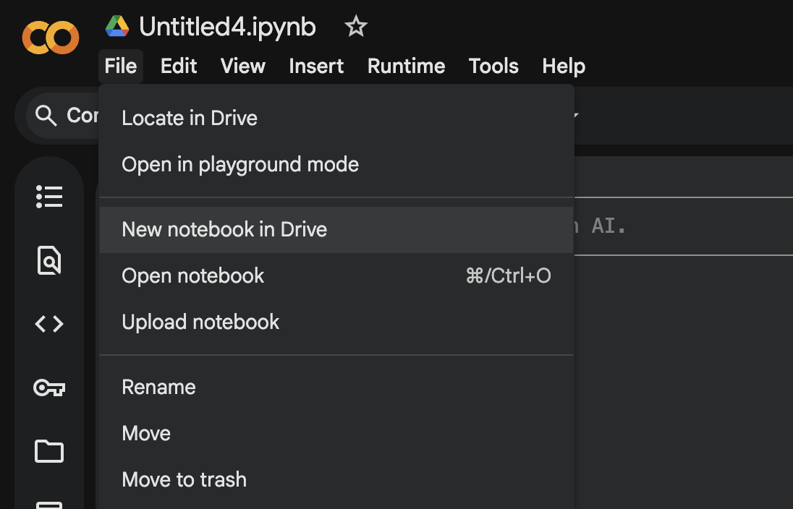

2. In the first cell, install the oracledb Python driver, which is the modern driver for Oracle Database connections:

    ```
    <copy>
    !pip install oracledb
    </copy>
    ```

    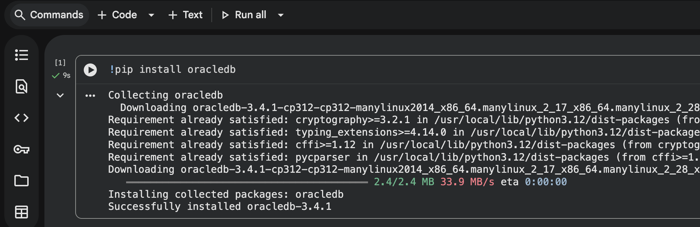

    Run the cell and wait for the installation to complete.

3. In a new cell, import the required libraries:

    ```
    <copy>
    import oracledb
    import pandas as pd
    </copy>
    ```

    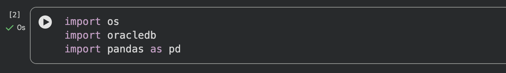

4. Mount Google Drive to access your wallet files (if not already mounted):

    ```
    <copy>
    from google.colab import drive
    drive.mount('/content/drive')
    </copy>
    ```

    

    Run this cell and authorize Drive access when prompted.

5. In a new cell, create your database connection configuration and establish the connection:

    ```
    <copy>
    # Database Connection Parameters
    # Replace these with your actual values from Task 2
    username = "<Your-DB-User>"  # Example: ADMIN
    password = "<Your-Password>"
    tns_name = "<Your-TNS-Alias>"  # Example: mydb_high
    wallet_path = "/content/drive/MyDrive/Wallet_MyDatabase"  # Update with your wallet path
    wallet_password = "<Your-Wallet-Password>"
    
    try:
        # Establish secure connection to Oracle Autonomous AI Database
        conn = oracledb.connect(
            user=username,
            password=password,
            dsn=tns_name,
            config_dir=wallet_path,
            wallet_location=wallet_path,
            wallet_password=wallet_password
        )
        
        print("✓ Successfully connected to Oracle Autonomous AI Database")
    except Exception as e:
        print(f"✗ Connection failed: {e}")
        conn = None
    </copy>
    ```

    Run this cell and verify that the connection is successful.

    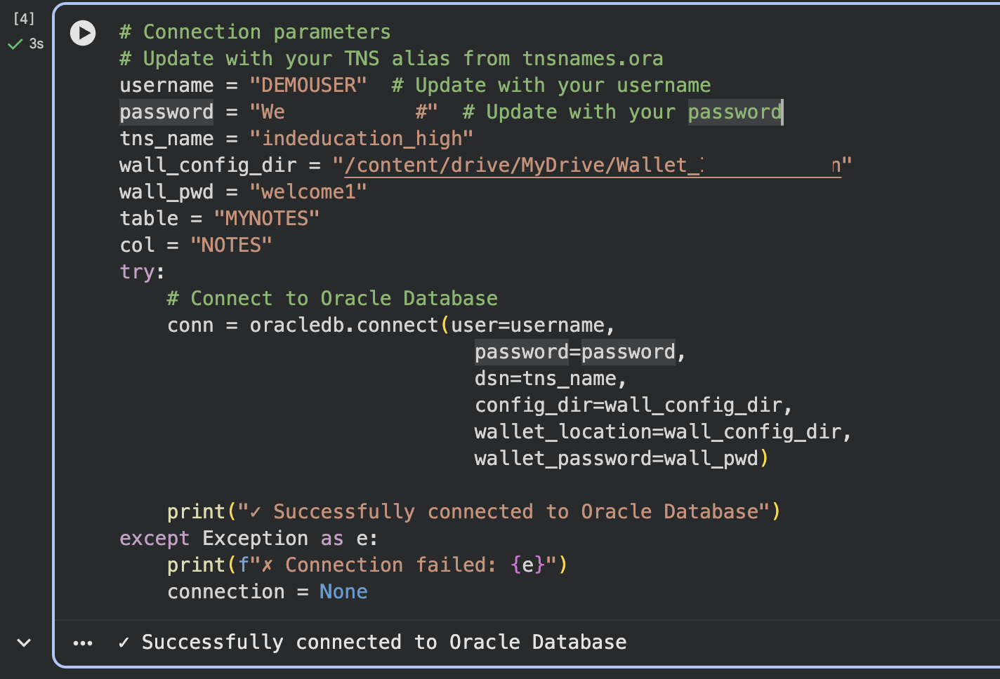

## Task 5: Query and Display Data

Execute SQL queries on your MYNOTES table and display results using pandas DataFrames for better visualization.

1. In a new cell, query the MYNOTES table and display the results:

    ```
    <copy>
    # Query the MYNOTES table
    if conn:
        try:
            cursor = conn.cursor()
            
            # Execute query to fetch sample records
            query = "SELECT * FROM MYNOTES WHERE ROWNUM <= 10"
            cursor.execute(query)
            
            # Fetch all records
            rows = cursor.fetchall()
            
            # Get column names from cursor description
            columns = [desc[0] for desc in cursor.description]
            
            # Create a pandas DataFrame for better visualization
            df = pd.DataFrame(rows, columns=columns)
            
            print(f"✓ Retrieved {len(df)} records from MYNOTES table\n")
            print(df.to_string(index=False))
            
            cursor.close()
        except Exception as e:
            print(f"✗ Query failed: {e}")
    else:
        print("✗ No database connection available")
    </copy>
    ```

    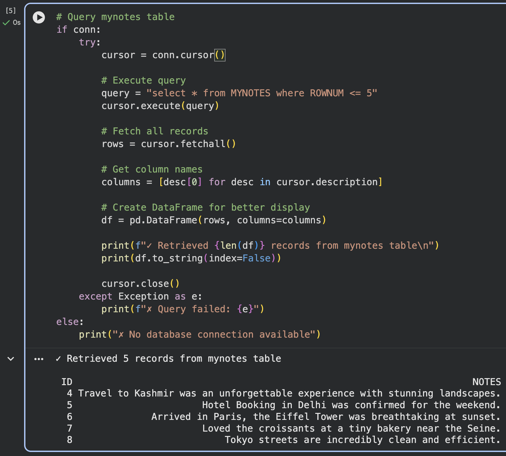

2. Run this cell to see your data displayed in a formatted table.

## Task 6: Close the Database Connection

Always close database connections when you're finished to free up resources.

1. In a new cell, add code to close the database connection:

    ```
    <copy>
    if conn:
        try:
            conn.close()
            print("✓ Database connection closed successfully")
        except Exception as e:
            print(f"✗ Error closing connection: {e}")
    </copy>
    ```

    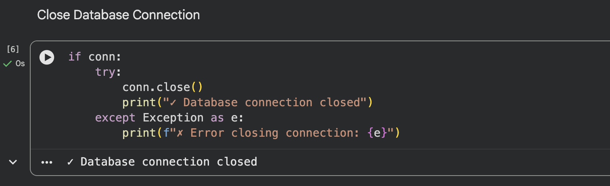

## Task 7: Save the Notebook to GitHub

Make your notebook easily accessible and shareable by saving it to a GitHub repository with automatic Colab integration.

1. In Google Colab, go to **File** > **Save a copy in GitHub** to save your notebook to a GitHub repository.

    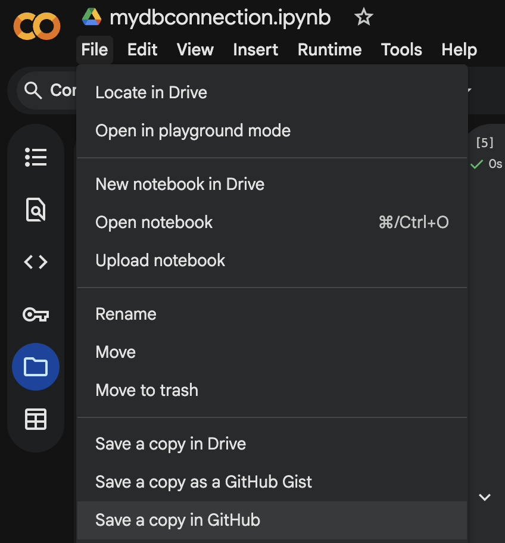

2. If prompted, authorize Google Colab to access your GitHub account. Select your target repository and branch, then save.

    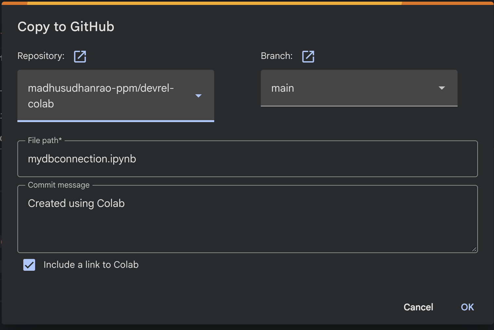

3. Once saved, your notebook will have an "Open in Colab" badge at the top of the GitHub file preview. Anyone with the repository link can now open the notebook directly in Colab with one click, making your work highly shareable and reproducible.

    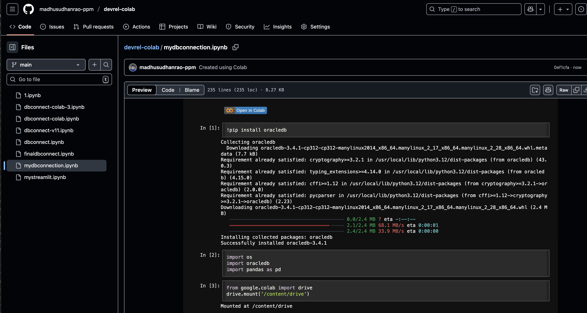

## Task 8: (Optional) Reopen Your Notebook

On subsequent visits, you can quickly access your saved notebook from multiple locations.

**From GitHub:**

1. Navigate to your GitHub repository and locate the `.ipynb` file.
2. The "Open in Colab" button appears automatically at the top of the file preview. Click it to open directly in Google Colab.

    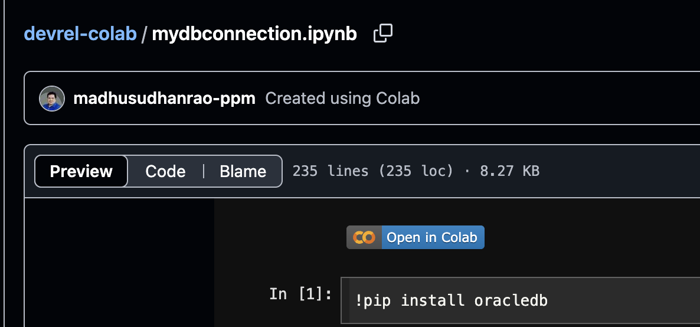

**From Google Drive:**

1. Go to [Google Drive](https://drive.google.com) and navigate to the folder containing your notebook.
2. Double-click the `.ipynb` file to open it in Google Colab.

    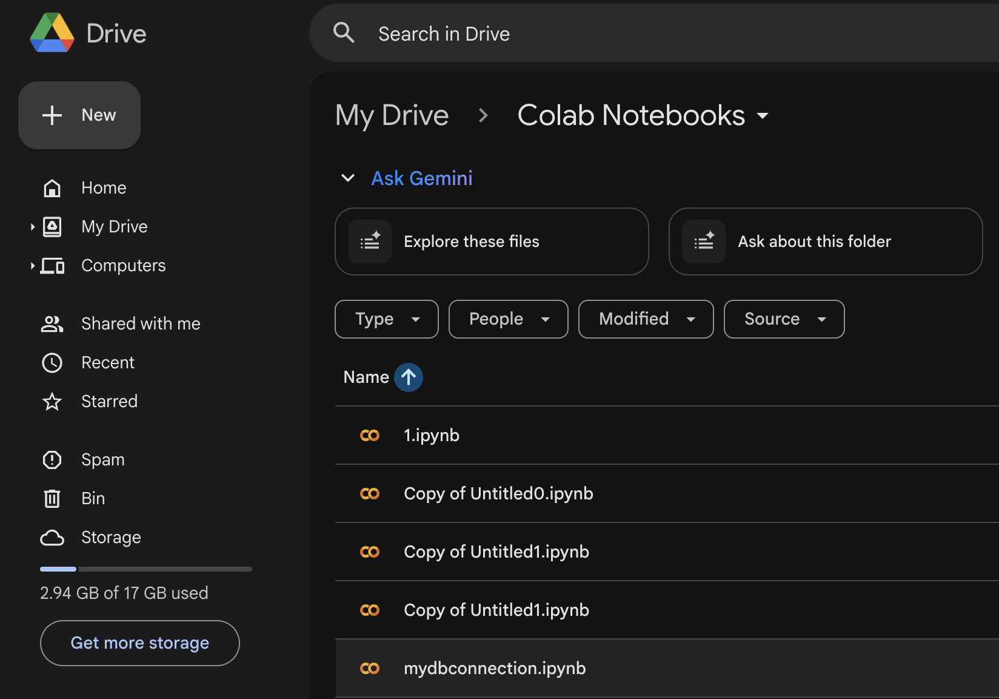

## Learn More

* [Oracle Autonomous AI Database for Developers - Documentation](https://docs.oracle.com/en-us/iaas/autonomous-database-serverless/doc/autonomous-database-for-developers.html)
* [Python oracledb Driver - Official Documentation](https://python-oracledb.readthedocs.io/)
* [Google Colab - Official Guide](https://colab.research.google.com/)
* [Google Colab FAQ - Working with Files](https://research.google.com/colaboratory/faq.html)
* [Oracle Autonomous Database for Developers - Billing Information](https://docs.oracle.com/en-us/iaas/autonomous-database-serverless/doc/autonomous-database-for-developers-billing.html)
* [Download Sample Notebook from GitHub](https://github.com/madhusudhanrao-ppm/devrel-colab/blob/main/mydbconnection.ipynb)

## Acknowledgements

* **Author** - Madhusudhan Rao, Principal Product Manager, Oracle Database DevRel
* **Last Updated By/Date** - December 9, 2025
 
**Download Source Code** - mydbconnection.ipynb from [GitHub Repository](https://github.com/madhusudhanrao-ppm/devrel-colab/blob/main/mydbconnection.ipynb) 

<!-- 
## Task 1: Create Table and Insert Sample Records

Create a MYNOTES table in your Oracle Autonomous Database with sample data that you'll query from Google Colab later.

1. Connect to your Oracle Autonomous AI Database using SQL Developer or the Database Actions tool and execute the following SQL:

    ```
    <copy>
    CREATE TABLE "MYNOTES" 
    (	
        "ID" NUMBER GENERATED BY DEFAULT ON NULL AS IDENTITY MINVALUE 1 MAXVALUE 99999999 
         INCREMENT BY 1 START WITH 4 CACHE 20 NOORDER  NOCYCLE  NOKEEP  NOSCALE  NOT NULL ENABLE, 
        "NOTES" VARCHAR2(4000 CHAR),  
        CONSTRAINT "MYNOTES_ID_PK" PRIMARY KEY ("ID")
        USING INDEX  ENABLE
    ) ;

    -- Insert records
    INSERT INTO MYNOTES (notes) VALUES ('Travel to Kashmir was an unforgettable experience with stunning landscapes.');
    INSERT INTO MYNOTES (notes) VALUES ('Hotel Booking in Delhi was confirmed for the weekend.'); 
    INSERT INTO MYNOTES (notes) VALUES ('Arrived in Paris, the Eiffel Tower was breathtaking at sunset.');
    INSERT INTO MYNOTES (notes) VALUES ('Loved the croissants at a tiny bakery near the Seine.');
    INSERT INTO MYNOTES (notes) VALUES ('Tokyo streets are incredibly clean and efficient.');
    INSERT INTO MYNOTES (notes) VALUES ('Central Park was a perfect escape from the city buzz.');
    INSERT INTO MYNOTES (notes) VALUES ('Bangkok night markets are a must‑try for street food.');
    INSERT INTO MYNOTES (notes) VALUES ('Sydney Opera House illuminated at night is unforgettable.');
    INSERT INTO MYNOTES (notes) VALUES ('Rome’s ancient ruins are best explored with a guide.');
    INSERT INTO MYNOTES (notes) VALUES ('Tapas in Barcelona were small but packed with flavor.');
    INSERT INTO MYNOTES (notes) VALUES ('Dubai’s desert safari was an exhilarating experience.');
    INSERT INTO MYNOTES (notes) VALUES ('Cape Town’s Table Mountain offered stunning panoramic views.'); 
    INSERT INTO MYNOTES (notes) VALUES ('Patient tolerated surgery well; margins clear.'); 
    INSERT INTO MYNOTES (notes) VALUES ('Started on pembrolizumab - mild fatigue reported.'); 
    INSERT INTO MYNOTES (notes) VALUES ('Completed 6 cycles of FOLFOX; CEA levels decreasing.'); 
    INSERT INTO MYNOTES (notes) VALUES ('Androgen deprivation therapy initiated; PSA dropped to 0.8 ng/mL.'); 
    INSERT INTO MYNOTES (notes) VALUES ('Bilateral lung metastases stable after 8 cycles of nivolumab.'); 
    INSERT INTO MYNOTES (notes) VALUES ('CR achieved after induction; proceeding to consolidation.'); 
    INSERT INTO MYNOTES (notes) VALUES ('Started on gemcitabine + nab‑paclitaxel; mild neutropenia noted.'); 
    INSERT INTO MYNOTES (notes) VALUES ('Debulking surgery successful; plan for platinum‑based chemo.'); 
    INSERT INTO MYNOTES (notes) VALUES ('PET scan shows complete metabolic response after 4 cycles of ABVD.'); 
    INSERT INTO MYNOTES (notes) VALUES ('Total thyroidectomy performed; awaiting radioactive iodine.');
    INSERT INTO MYNOTES (notes) VALUES ('Breast cancer screening scheduled for next month.');
    INSERT INTO MYNOTES (notes) VALUES ('Lung cancer screening scheduled for next month.');
    </copy>
      ``` 

## Task 2: Download Wallet and Connection Details

1. Check the Database version 19c is shown in the Database details page, Alternatively you can also use latest 26ai Oracle Autonomous AI Database for this lab. 

    

    From the top right navigation menu click on **Database Connection** button to download the wallet and connection details.

    

2. Download wallet and Copy connection details. 

     

    Provide wallet password and save the wallet. 

3. Copy and save TNS Name, which would be of the following format, where database name and region will change. we will need this details for database connection.  

    ```
    <copy>
    devdbhs556l_high = (description= (retry_count=20)(retry_delay=3)(address=(protocol=tcps)(port=1522)(host=adb.us-phoenix-1.oraclecloud.com))(connect_data=(service_name=wkrfstesta1jcu_devdbhs556l_high.adb.oraclecloud.com))(security=(ssl_server_dn_match=yes)))
    </copy>  
    ```
  
## Task 3: Upload Database Wallet files to Google Drive Folder

1. Mounting Google Drive on Colab allows any code in your notebook to access any files in your Google Drive. This usually require that users manually grant this access every time they connect to a new runtime by adding a code cell to the notebook. This ensures that the user fully understands the permissions being granted to the notebook.

2. In some cases, we only require Google Drive authorization once, and automatically re-mount Google Drive during future sessions. To protect your files, Google only allow this when a notebook passes multiple checks.  [More info](https://research.google.com/colaboratory/faq.html#drive-mount-code-cell)
3. Upload the Oracle Autonomous Database Wallet files to Google Drive

     

4. In the [Google Colab](https://colab.research.google.com/), Create a new notebook and click on files icon and create a new drive mount connection. 

    

5. Authorize Google Colab to use Google Drive
    
    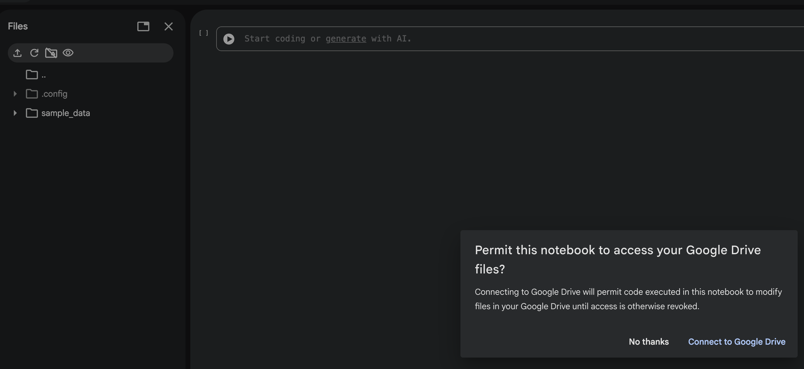

6. You should now see your wallet files.

    

7. Copy the folder path next to the folder name. for example

    ```
    /content/drive/MyDrive/Wallet_IndEducation 
    ```

## Task 4: Create New NoteBook File

1. Create New Notebook File 

    

    ```
    <copy>
    !pip install oracledb
    </copy>
    ```

    

2. Run the code block

3. Create new code block with required inputs & run the code block

    ``` 
    <copy>
    import os
    import oracledb
    import pandas as pd 
    </copy>
    ```

    

4. Mount Google Drive 

    ```
    <copy>
    from google.colab import drive
    drive.mount('/content/drive')
    </copy>
    ``` 

    

5. Authorize Google Drive Connection

    

6. Add new code block and establish Database Connection

    ``` 
    <copy>
    # Connection parameters
    # Update with your TNS alias from tnsnames.ora
    username = "YourDBUser"  # Update with your username
    password = "YourDBPassword"  # Update with your password
    tns_name = "YourConnection_high"
    wall_config_dir = "/content/drive/MyDrive/Wallet_Folder"
    wall_pwd = "YourWalletPassword"
    table = "MYNOTES"
    col = "NOTES"
    try:
        # Connect to Oracle Database
        conn = oracledb.connect(user=username,
                                password=password,
                                dsn=tns_name,
                                config_dir=wall_config_dir,
                                wallet_location=wall_config_dir,
                                wallet_password=wall_pwd)

        print("✓ Successfully connected to Oracle Database")
    except Exception as e:
        print(f"✗ Connection failed: {e}")
        connection = None 
    </copy>
    ```

    Run the code block and verify database connection

    

7. Display Records in a loop
 
    ``` 
    <copy>
    # Query mynotes table
    if conn:
        try:
            cursor = conn.cursor()

            # Execute query
            query = "select * from MYNOTES where ROWNUM <= 10"
            cursor.execute(query)

            # Fetch all records
            rows = cursor.fetchall()

            # Get column names
            columns = [desc[0] for desc in cursor.description]

            # Create DataFrame for better display
            df = pd.DataFrame(rows, columns=columns)

            print(f"✓ Retrieved {len(df)} records from mynotes table\n")
            print(df.to_string(index=False))

            cursor.close()
        except Exception as e:
            print(f"✗ Query failed: {e}")
    else:
        print("✗ No database connection available")
    </copy>
    ```

    

8. Close Database Connection 

    ``` 
    <copy>
    if conn:
    try:
        conn.close()
        print("✓ Database connection closed")
    except Exception as e:
        print(f"✗ Error closing connection: {e}")
    </copy>
    ```

    

## Task 5: Save the Code in GitHub Repository

1. Rename the file saved in Google Drive and Save a copy of this file in GitHub Repo

    

2.  Copy to GitHub, Select the Repo Name and Branch

    
  
3.  Now this file is saved in GitHub Repo with Open in Colab Button on top. Please not you would need to authorize Google Colab and GitHub Repository to work seemless together 

    

## Task 6: (Optional) Open the Notebook file from GitHub into Google Colab
     
1. Next time you can open the Notebook file by clicking on Open in Colab button

    

## Task 7: (Optional) Open the Notebook file from Google Drive
     
1. You can also open the Notebook file by clicking on Google Drive Folder and locating the .ipynb file

    
## Learn More

* [Oracle Autonomous AI Database for Developers - Documentation](https://docs.oracle.com/en-us/iaas/autonomous-database-serverless/doc/autonomous-database-for-developers.html)
* [Python oracledb Driver - Official Documentation](https://python-oracledb.readthedocs.io/)
* [Google Colab - Official Guide](https://colab.research.google.com/)
* [Google Colab FAQ - Working with Files](https://research.google.com/colaboratory/faq.html)
* [Oracle Autonomous Database for Developers - Billing Information](https://docs.oracle.com/en-us/iaas/autonomous-database-serverless/doc/autonomous-database-for-developers-billing.html)
* [Download Sample Notebook from GitHub](https://github.com/madhusudhanrao-ppm/devrel-colab/blob/main/mydbconnection.ipynb)

## Acknowledgements

* **Author** - Madhusudhan Rao, Principal Product Manager, Oracle Database DevRel
* **Last Updated By/Date** - December 9, 2025 -->
