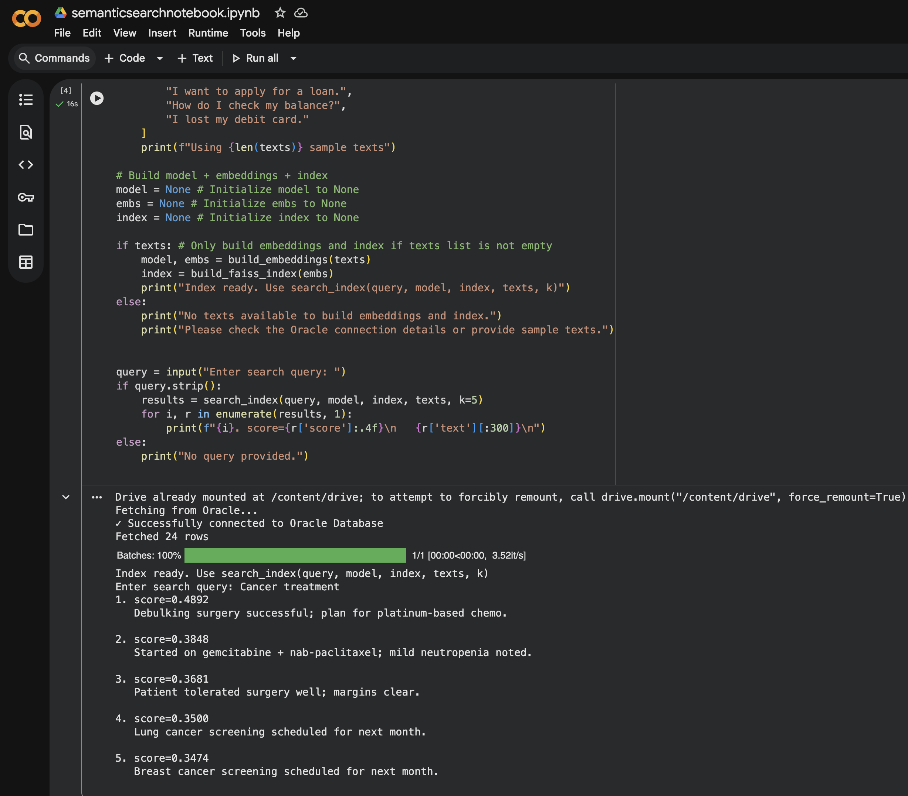
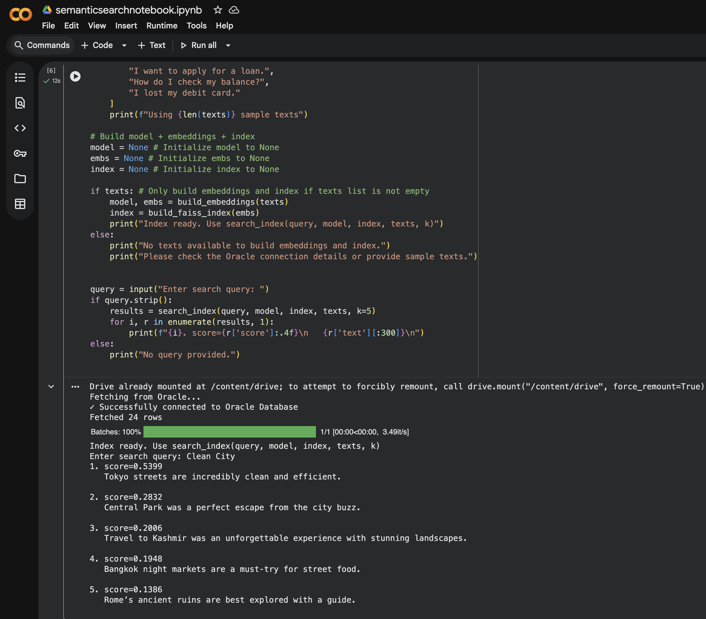

# Create Google Colab Notebook Applications with Oracle Autonomous AI Database

## Introduction

In this lab, you will learn how to develop and run Python applications in Google Colab that connect to Oracle Autonomous AI Database. You'll mount your database wallet files from Google Drive, establish secure connections, and execute queries using the oracledb Python driver. By the end, you'll have a fully functional notebook that performs CRUD operations and is saved in both Google Drive and GitHub for easy sharing and reusability.  

[Google Colab Jupyter Notebook](https://colab.research.google.com/) is widely used because it provides an interactive, cell-based environment that seamlessly blends live code, immediate output (including data visualizations), and narrative text into a single, shareable document. This makes it an ideal tool for data science, research, and education. 
Key Advantages of Jupyter Notebook

**Interactive and Iterative Coding:** Code can be broken down into small, independent cells and executed one section at a time. This allows for a fast feedback loop, making it easy to test snippets, debug, and experiment with data without running the entire script from the beginning.

**Inline Data Visualization and Rich Output:** The output of code cells, such as data tables (pandas DataFrames), plots (from libraries like Matplotlib or Seaborn), images, and even videos, are displayed directly beneath the corresponding code cell. This immediate visual feedback is crucial for exploratory data analysis (EDA) and machine learning workflows.

**Integrated Documentation:** You can interleave code cells with rich text using Markdown cells. This allows for detailed explanations, mathematical equations (using LaTeX), and images alongside the code, which helps document the thought process and methodology, effectively telling a "computational narrative".

**Easy Sharing and Collaboration:** Notebooks are saved in a portable JSON format (.ipynb files), making them easy to share with colleagues or stakeholders. They can also be converted into various static formats like HTML, PDF, or Markdown for presentations or blog posts. Services like GitHub and NBViewer can render these notebooks directly in a browser.

Estimated Time: 15 to 20 minutes.

### Objectives

In this lab, you will:

* Set up Oracle Autonomous AI Database tables with sample data
* Download and configure database wallet credentials
* Mount Google Drive in Google Colab and upload wallet files
* Install and configure the oracledb Python driver
* Establish secure connections to Oracle Database from Colab
* Execute queries and display results using pandas DataFrames
* Save your notebook to GitHub with one-click Colab integration
* Run Semantic Similarity Search for Oracle Database 19c in Google Colab


[Colab Notebook](youtube:TPQiD2m0kXA:large)  

### Prerequisites

This lab assumes you have:

* Oracle Cloud account with privileges to create and manage Oracle Autonomous AI Database
* Oracle Autonomous AI Database instance that has been created and is running
* Basic knowledge of Python programming language
* Basic knowledge of SQL and Oracle Database concepts
* A Google account with access to Google Drive and Google Colab
* A GitHub account (optional, but recommended for sharing your notebook)


**Download Source Code** - Complete example notebook is available in [this GitHub Repository](https://github.com/madhusudhanrao-ppm/dbdevrel/tree/main/source-codes/colab-code)

## Task 1: Create Table and Insert Sample Records

Create a MYNOTES table in your Oracle Autonomous Database with sample data that you'll query from Google Colab later.

1. Connect to your Oracle Autonomous AI Database using SQL Developer, Database Actions, or the Oracle Cloud Console SQL Worksheet. Execute the following SQL commands:

    ```
    <copy>
    CREATE TABLE "MYNOTES" 
    (
        "ID" NUMBER GENERATED BY DEFAULT ON NULL AS IDENTITY MINVALUE 1 MAXVALUE 99999999 
         INCREMENT BY 1 START WITH 1 CACHE 20 NOORDER  NOCYCLE  NOKEEP  NOSCALE  NOT NULL ENABLE, 
        "NOTES" VARCHAR2(4000 CHAR),  
        CONSTRAINT "MYNOTES_ID_PK" PRIMARY KEY ("ID")
        USING INDEX ENABLE
    );

    -- Insert sample travel notes
    INSERT INTO MYNOTES (notes) VALUES ('Travel to Kashmir was an unforgettable experience with stunning landscapes.');
    INSERT INTO MYNOTES (notes) VALUES ('Hotel Booking in Delhi was confirmed for the weekend.'); 
    INSERT INTO MYNOTES (notes) VALUES ('Arrived in Paris, the Eiffel Tower was breathtaking at sunset.');
    INSERT INTO MYNOTES (notes) VALUES ('Loved the croissants at a tiny bakery near the Seine.');
    INSERT INTO MYNOTES (notes) VALUES ('Tokyo streets are incredibly clean and efficient.');
    INSERT INTO MYNOTES (notes) VALUES ('Central Park was a perfect escape from the city buzz.');
    INSERT INTO MYNOTES (notes) VALUES ('Bangkok night markets are a must-try for street food.');
    INSERT INTO MYNOTES (notes) VALUES ('Sydney Opera House illuminated at night is unforgettable.');
    INSERT INTO MYNOTES (notes) VALUES ('Rome''s ancient ruins are best explored with a guide.');
    INSERT INTO MYNOTES (notes) VALUES ('Tapas in Barcelona were small but packed with flavor.');
    
    COMMIT;
    </copy>
    ```

2. Verify the table was created successfully by running:

    ```
    <copy>
    SELECT COUNT(*) FROM MYNOTES;
    </copy>
    ```

    You should see a result of 10 rows.

## Task 2: Download Wallet and Connection Details

Download and securely store your Oracle Autonomous Database wallet, which contains the credentials needed to connect from Google Colab.

1. In the OCI Console, navigate to your Autonomous Database instance. Note that you can use Oracle Autonomous AI Database 26ai or 23ai for this lab.

    

    From the top-right navigation menu, click the **Database Connection** button to access wallet and connection options.

    

2. Download the wallet in ZIP format. You will be prompted to provide a wallet password for encryption.

    

    Save the wallet file securely. You will need both the wallet files and the wallet password to connect from Google Colab.

3. Extract the wallet ZIP file on your local machine. Inside, you'll find a `tnsnames.ora` file that contains TNS (Transparent Network Substrate) entries. Copy and save the TNS Name you plan to use. The format looks like:

    ```
    <copy>
    mydb_high = (description= (retry_count=20)(retry_delay=3)(address=(protocol=tcps)(port=1522)(host=adb.us-phoenix-1.oraclecloud.com))(connect_data=(service_name=mydb_high.adb.oraclecloud.com))(security=(ssl_server_dn_match=yes)))
    </copy>
    ```

    Note down:
    - Your TNS alias name (e.g., `mydb_high`)
    - Your database username (e.g., `ADMIN`)
    - Your database password
    - Your wallet password

    You will need these details in the later steps to establish the database connection from Google Colab.

## Task 3: Upload Database Wallet Files to Google Drive

Mount Google Drive in Google Colab and upload your wallet files for secure access during Python execution.

**Security Note:** Mounting Google Drive in Colab requires explicit authorization each time you connect to a new Colab runtime. This ensures you maintain full control over what code can access. [Learn more about Colab Drive access](https://research.google.com/colaboratory/faq.html#drive-mount-code-cell)

1. On your local machine, create a folder (e.g., `Wallet_MyDatabase`) containing all the wallet files extracted from the ZIP download.

2. Upload this wallet folder to your Google Drive:

    

3. Open [Google Colab](https://colab.research.google.com/) and create a new notebook. In the left sidebar, click the **Files** icon to access file management.

    

4. Click the **Mount Drive** button or use code to mount Google Drive:

    ```
    <copy>
    from google.colab import drive
    drive.mount('/content/drive')
    </copy>
    ```

    

5. A dialog will appear asking you to authorize Google Colab to access your Google Drive. Click the authorization link, sign in with your Google account, copy the verification code, and paste it into the Colab prompt.
    
    

6. After authorization, you will see your Google Drive folder structure, including your wallet folder.

    

7. Right-click on your wallet folder and select **Copy path** to get the full path. It will look similar to:

    ```
    /content/drive/MyDrive/Wallet_MyDatabase
    ```

    Keep this path for use in the next task.

## Task 4: Create a New Notebook and Establish Database Connection

Now you'll create a Python notebook in Google Colab with code to connect to Oracle Autonomous AI Database.

1. Create a new notebook in [Google Colab](https://colab.research.google.com/).

    

2. In the first cell, install the oracledb Python driver, which is the modern driver for Oracle Database connections:

    ```
    <copy>
    !pip install oracledb
    </copy>
    ```

    

    Run the cell and wait for the installation to complete.

3. In a new cell, import the required libraries:

    ```
    <copy>
    import oracledb
    import pandas as pd
    </copy>
    ```

    

4. Mount Google Drive to access your wallet files (if not already mounted):

    ```
    <copy>
    from google.colab import drive
    drive.mount('/content/drive')
    </copy>
    ```

    

    Run this cell and authorize Drive access when prompted.

5. In a new cell, create your database connection configuration and establish the connection:

    ```
    <copy>
    # Database Connection Parameters
    # Replace these with your actual values from Task 2
    username = "<Your-DB-User>"  # Example: ADMIN
    password = "<Your-Password>"
    tns_name = "<Your-TNS-Alias>"  # Example: mydb_high
    wallet_path = "/content/drive/MyDrive/Wallet_MyDatabase"  # Update with your wallet path
    wallet_password = "<Your-Wallet-Password>"
    
    try:
        # Establish secure connection to Oracle Autonomous AI Database
        conn = oracledb.connect(
            user=username,
            password=password,
            dsn=tns_name,
            config_dir=wallet_path,
            wallet_location=wallet_path,
            wallet_password=wallet_password
        )
        
        print("✓ Successfully connected to Oracle Autonomous AI Database")
    except Exception as e:
        print(f"✗ Connection failed: {e}")
        conn = None
    </copy>
    ```

    Run this cell and verify that the connection is successful.

    

## Task 5: Query and Display Data

Execute SQL queries on your MYNOTES table and display results using pandas DataFrames for better visualization.

1. In a new cell, query the MYNOTES table and display the results:

    ```
    <copy>
    # Query the MYNOTES table
    if conn:
        try:
            cursor = conn.cursor()
            
            # Execute query to fetch sample records
            query = "SELECT * FROM MYNOTES WHERE ROWNUM <= 10"
            cursor.execute(query)
            
            # Fetch all records
            rows = cursor.fetchall()
            
            # Get column names from cursor description
            columns = [desc[0] for desc in cursor.description]
            
            # Create a pandas DataFrame for better visualization
            df = pd.DataFrame(rows, columns=columns)
            
            print(f"✓ Retrieved {len(df)} records from MYNOTES table\n")
            print(df.to_string(index=False))
            
            cursor.close()
        except Exception as e:
            print(f"✗ Query failed: {e}")
    else:
        print("✗ No database connection available")
    </copy>
    ```

    

2. Run this cell to see your data displayed in a formatted table.

## Task 6: Close the Database Connection

Always close database connections when you're finished to free up resources.

1. In a new cell, add code to close the database connection:

    ```
    <copy>
    if conn:
        try:
            conn.close()
            print("✓ Database connection closed successfully")
        except Exception as e:
            print(f"✗ Error closing connection: {e}")
    </copy>
    ```

    

## Task 7: Save the Notebook to GitHub

Make your notebook easily accessible and shareable by saving it to a GitHub repository with automatic Colab integration.

1. In Google Colab, go to **File** > **Save a copy in GitHub** to save your notebook to a GitHub repository.

    

2. If prompted, authorize Google Colab to access your GitHub account. Select your target repository and branch, then save.

    

3. Once saved, your notebook will have an "Open in Colab" badge at the top of the GitHub file preview. Anyone with the repository link can now open the notebook directly in Colab with one click, making your work highly shareable and reproducible.

    

## Task 8: (Optional) Reopen Your Notebook

On subsequent visits, you can quickly access your saved notebook from multiple locations.

**From GitHub:**

1. Navigate to your GitHub repository and locate the `.ipynb` file.
2. The "Open in Colab" button appears automatically at the top of the file preview. Click it to open directly in Google Colab.

    

**From Google Drive:**

1. Go to [Google Drive](https://drive.google.com) and navigate to the folder containing your notebook.
2. Double-click the `.ipynb` file to open it in Google Colab.

    

## Task 9: (Optional) Run Semantic Similarity Search for Oracle Database 19c in Google Colab

Learn more about [Semantic Similarity Search for Oracle Database 19c in this Lab](https://madhusudhanrao-ppm.github.io/dbdevrel/similarity-search-19c/index.html), Here we will replace **Streamlit Web application version with Google Colab Jupyter Notebook version** 

Please Note > The same code shown below would also work for Oracle Database 23ai or 26ai versions.

1. [Open the Jupyter Notebook](https://github.com/madhusudhanrao-ppm/dbdevrel/blob/main/source-codes/colab-code/similaritysearch-colab.ipynb) file in Google Colab 
2. Run the Notebook

    ```
    <copy>
    !pip install -q sentence-transformers faiss-cpu oracledb numpy
    </copy>
    ```
3. Ensure that Database Table is already created and Database wallet files are already uploaded to Google Drive

4. Run the main Jupyter Notebook code

    ```
    <copy> 
    import json
    from typing import List, Dict, Optional
    import numpy as np
    import oracledb
    from sentence_transformers import SentenceTransformer
    import faiss
    from google.colab import drive
    drive.mount('/content/drive')

    MODEL_NAME = "sentence-transformers/all-MiniLM-L6-v2"

    def fetch_from_oracle(
        table: str = "MYNOTES",
        column: str = "NOTES",
        max_rows: int = 1000,
        use_wallet: bool = True,
        wallet_dir: Optional[str] = None,
    ) -> List[str]:
        """Fetch text rows from Oracle. Uses env vars ORACLE_USER, ORACLE_PASSWORD, ORACLE_DSN.
        If use_wallet=True, provide wallet_dir and wallet_password via env vars.
        Returns list of strings (may be empty).
        """
        username = "YourDBUser"  # Update with your username
        password = "YourPassword"  # Update with your password
        tns_name = "indeducation_high"
        wall_config_dir = "/content/drive/MyDrive/Wallet_Folder"
        wall_pwd = "walletpassword"
        table = "MYNOTES"
        col = "NOTES"

        if not (username and password and tns_name):
            print("Oracle credentials (ORACLE_USER, ORACLE_PASSWORD, ORACLE_DSN) not set. Returning empty list.")
            return []

        conn = None
        try:
            conn = oracledb.connect(user=username,
                                password=password,
                                dsn=tns_name,
                                config_dir=wall_config_dir,
                                wallet_location=wall_config_dir,
                                wallet_password=wall_pwd)

            # Always use config_dir and wallet_location if wall_config_dir is set,
            # as TNS aliases often require it to find tnsnames.ora.
            
            print("✓ Successfully connected to Oracle Database")

            cur = conn.cursor()
            sql = f"SELECT {column} FROM {table} WHERE {column} IS NOT NULL AND ROWNUM <= :maxrows"
            cur.execute(sql, [max_rows])
            rows = cur.fetchall()
            texts = [r[0] for r in rows if r and r[0] is not None]
            cur.close()
            return texts
        except Exception as e:
            print(f"Error fetching from Oracle: {e}")
            return []
        finally:
            if conn:
                try:
                    conn.close()
                except Exception:
                    pass

    def build_embeddings(texts: List[str], model_name: str = MODEL_NAME, batch_size: int = 64):
        """Return (model, numpy array of embeddings L2-normalized)."""
        model = SentenceTransformer(model_name)
        embs = model.encode(texts, batch_size=batch_size, convert_to_numpy=True, show_progress_bar=True)
        # normalize
        faiss.normalize_L2(embs)
        return model, embs

    def build_faiss_index(embs: np.ndarray):
        """Create an inner-product index. Inputs should be L2-normalized vectors; inner product == cosine similarity."""
        dim = embs.shape[1]
        index = faiss.IndexFlatIP(dim)
        index.add(embs)
        return index

    def search_index(query: str, model: SentenceTransformer, index: faiss.IndexFlatIP, texts: List[str], k: int = 5):
        q_emb = model.encode([query], convert_to_numpy=True)
        faiss.normalize_L2(q_emb)
        D, I = index.search(q_emb, k)
        # D contains inner products (cosine similarity between -1 and 1)
        results = []
        for score, idx in zip(D[0], I[0]):
            if idx < 0:
                continue
            results.append({"index": int(idx), "text": texts[idx], "score": float(score)})
        return results

    def save_index(path_prefix: str, embs: np.ndarray, texts: List[str]):
        np.save(f"{path_prefix}_emb.npy", embs)
        with open(f"{path_prefix}_texts.json", "w", encoding="utf-8") as f:
            json.dump(texts, f, ensure_ascii=False)

    def load_index(path_prefix: str):
        embs = np.load(f"{path_prefix}_emb.npy")
        with open(f"{path_prefix}_texts.json", "r", encoding="utf-8") as f:
            texts = json.load(f)
        index = build_faiss_index(embs)
        return index, embs, texts


    # Configuration: switch to True to fetch from Oracle
    use_oracle = True

    texts = []
    if use_oracle:
        print("Fetching from Oracle...")
        # Note: 'use_wallet=False' was passed here, but the DSN might still implicitly require a config_dir.
        # The hardcoded values for Oracle connection parameters inside fetch_from_oracle also need review.
        texts = fetch_from_oracle(table="MYNOTES", column="NOTES", max_rows=1000, use_wallet=False)
        print(f"Fetched {len(texts)} rows")
    else:
        texts = [
            "I want to open an account.",
            "I want a credit card.",
            "I need to update my address.",
            "I want to apply for a loan.",
            "How do I check my balance?",
            "I lost my debit card."
        ]
        print(f"Using {len(texts)} sample texts")

    # Build model + embeddings + index
    model = None # Initialize model to None
    embs = None # Initialize embs to None
    index = None # Initialize index to None

    if texts: # Only build embeddings and index if texts list is not empty
        model, embs = build_embeddings(texts)
        index = build_faiss_index(embs)
        print("Index ready. Use search_index(query, model, index, texts, k)")
    else:
        print("No texts available to build embeddings and index.")
        print("Please check the Oracle connection details or provide sample texts.")


    query = input("Enter search query: ")
    if query.strip():
        results = search_index(query, model, index, texts, k=5)
        for i, r in enumerate(results, 1):
            print(f"{i}. score={r['score']:.4f}\n   {r['text'][:300]}\n")
    else:
        print("No query provided.")

    </copy>
    ```
5. Similarity Search for Cancer Treatment
    

6. Similarity Search for Clean City
    
 
## Learn More

* [Oracle Autonomous AI Database for Developers - Documentation](https://docs.oracle.com/en-us/iaas/autonomous-database-serverless/doc/autonomous-database-for-developers.html)
* [Python oracledb Driver - Official Documentation](https://python-oracledb.readthedocs.io/)
* [Google Colab - Official Guide](https://colab.research.google.com/)
* [Google Colab FAQ - Working with Files](https://research.google.com/colaboratory/faq.html)
* [Oracle Autonomous Database for Developers - Billing Information](https://docs.oracle.com/en-us/iaas/autonomous-database-serverless/doc/autonomous-database-for-developers-billing.html)
* [Download Colab Notebook code from GitHub](https://github.com/madhusudhanrao-ppm/dbdevrel/tree/main/source-codes/colab-code)

## Acknowledgements

* **Author** - Madhusudhan Rao, Principal Product Manager, Oracle Database DevRel
* **Last Updated By/Date** - December 11th, 2025.
 
**Download Source Code** - mydbconnection.ipynb from [GitHub Repository](https://github.com/madhusudhanrao-ppm/dbdevrel/tree/main/source-codes/colab-code) 
 