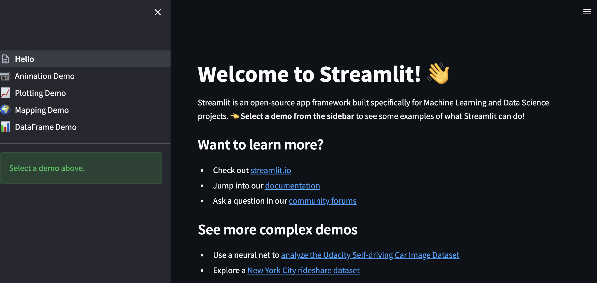
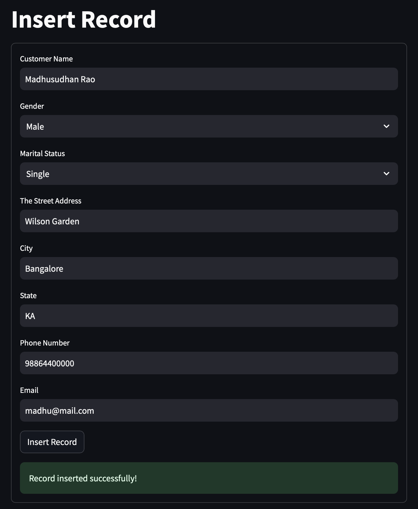
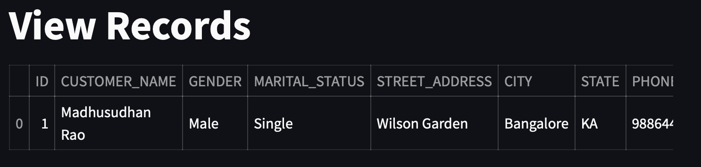

# Develop Streamlit Python Applications with Oracle Autonomous AI Database

## Introduction

In this Lab, we'll take you on a journey to build a full-stack application using Oracle Cloud, Streamlit Python Application for CRUD operations.
   
[Streamlit](https://streamlit.io) is an open-source Python framework that allows data scientists and machine learning engineers to create interactive web applications without needing front-end development skills. It simplifies turning data scripts into shareable web apps, dashboards, and visualizations with only a few lines of Python code 

### Prerequisites

This lab assumes:

* An Autonomous Database has been created.
* A wallet has been downloaded. 
* Network  Mutual TLS **(mTLS)** authentication **Not required** and Access control list **Enabled** (Please see Lab 1 and Task 6)
  
## Task 1: Setup Python environment and Install Streamlit

1. Setup Python environment

    ```
    <copy>
    [opc@indmcpprimary ~]$ sudo su - oracle
    Last login: Mon Oct 13 17:00:51 GMT 2025 on pts/2
    [oracle@indmcpprimary ~]$ mkdir mypyapp
    [oracle@indmcpprimary ~]$ cd mypyapp/
    [oracle@indmcpprimary mypyapp]$ python3 -m venv venv
    [oracle@indmcpprimary mypyapp]$ source venv/bin/activate
    (venv) [oracle@indmcpprimary mypyapp]$ pip install --upgrade pip
    </copy>
    ```   

2. Install Streamlit and find its version

    ```
    <copy>
    (venv) [oracle@indmcpprimary mypyapp]$ pip3 install streamlit
    ..
    (venv) [oracle@indmcpprimary mypyapp]$ streamlit version
    Streamlit, version 1.10.0
    </copy>
    ``` 

## Task 2: Run Hello Streamlit application

1. Run simple helloworld streamlit application

    ```
    <copy>
    [oracle@indmcpprimary mypyapp]$ source venv/bin/activate
    (venv) [oracle@indmcpprimary mypyapp]$ streamlit hello

    -- if required upgrade 

    (venv) [oracle@indmcpprimary mypyapp]$ 
    pip install streamlit --upgrade
    </copy>
    ```   

    

    Access Streamlit Hello website at http://<your-public-ip\>:8501/ or http://localhost:8501/
  
    Press ctrl + C to exit the server

## Task 3: Install Python-oracledb driver & Oracle CX Python extension 

1. The python-oracledb driver is the widely used, open-source Python programming language extension module allowing Python programs to connect directly to Oracle Database with no extra libraries needed. The module is built with Cython for safety and speed. It is lightweight and high-performance. It is stable, well tested, and has comprehensive documentation. The module is maintained by Oracle.

    Refer [Installation guide](https://python-oracledb.readthedocs.io/en/latest/user_guide/installation.html)

    ```
    <copy>
    (venv) [oracle@indmcpprimary mypyapp]$ 
    python -m pip install oracledb
    </copy>
      ``` 
2. Install Oracle CX Python extension

    cx\_Oracle is a Python extension module that enables access to Oracle Database. It conforms to the Python database API 2.0 specification with a considerable number of additions and a couple of exclusions. See the homepage for a feature list.
    cx\_Oracle 8.3 has been tested with Python versions 3.6 through 3.10. You can use cx_Oracle with Oracle 11.2, 12c, 18c, 19c and 21c client libraries. Oracle's standard client-server version interoperability allows connection to both older and newer databases. For example Oracle 19c client libraries can connect to Oracle Database 11.2. Older versions of cx\_Oracle may work with older versions of Python.
 
    ```
    <copy>
    (venv) [oracle@indmcpprimary mypyapp]$ 
    python3 -m pip install cx_oracle
    </copy>
      ``` 

## Task 4: Install SQL Developer and Connect to Database

1. Install the [VSCode extension SQL Developer](https://marketplace.visualstudio.com/items?itemName=Oracle.sql-developer), create a connection. Upload Database wallet use **Cloud Wallet** connection type
 
    

2. Create Bank Customers table, You can use **SQL Worksheets** on Autonomous Database Console or Use **SQL Developer** VSCode Extension to create this table.

    ```
    <copy>
    CREATE TABLE "BANK_CUSTOMERS" 
    (	
        "ID" NUMBER GENERATED BY DEFAULT ON NULL AS IDENTITY MINVALUE 1 
        MAXVALUE 99999  
        INCREMENT BY 1 START WITH 1 CACHE 20 NOORDER  NOCYCLE  
        NOKEEP  NOSCALE  NOT NULL ENABLE, 
        "CUSTOMER_NAME" VARCHAR2(100), 
        "GENDER" VARCHAR2(10),  
        "MARITAL_STATUS" VARCHAR2(50), 
        "STREET_ADDRESS" VARCHAR2(255),  
        "CITY" VARCHAR2(50), 
        "STATE" VARCHAR2(50),  
        "PHONE_NUMBER" VARCHAR2(50),   
        "EMAIL" VARCHAR2(128), 
        PRIMARY KEY ("ID")
        USING INDEX  ENABLE
    ) ;
    </copy>
    ``` 

## Task 5: Create a simple Streamlit application for CRUD operation on the Bank Customers table

1. Write streamlit code for CRUD operations.

    ```
    <copy>
    import streamlit as st
    import cx_Oracle
    import oracledb 
    import pandas as pd

    # Oracle database connection settings
    username = 'DEMOUSER'
    password = 'YourPassword'
    dsn = '(description= (retry_count=20)(retry_delay=3)(address=(protocol=tcps)(port=1522)(host=adb.ap-mumbai-1.oraclecloud.com))(connect_data=(service_name=r9nv7xxvf7rhn_indeducation_high.adb.oraclecloud.com))(security=(ssl_server_dn_match=yes)))'
    tns_name = "indeducation_high"
    wall_config_dir = "/Wallets_folder/Wallet_IndEducation" 
    wall_pwd = "welcome1"

    # Create a connection to the Oracle database
    def create_connection():
        try: 
            connection = oracledb.connect(user=username, 
                                password=password,
                                dsn=tns_name,
                                config_dir=wall_config_dir,
                                wallet_location=wall_config_dir,
                                wallet_password=wall_pwd)
            return connection
        except cx_Oracle.Error as e:
            st.error(f"Error connecting to database: {e}")
            return None

    # View all records from the BANK_CUSTOMERS table
    def view_records():
        connection = create_connection()
        if connection:
            try:
                cursor = connection.cursor()
                query = "SELECT * FROM BANK_CUSTOMERS"
                cursor.execute(query)
                records = cursor.fetchall()
                column_names = [desc[0] for desc in cursor.description]
                return records, column_names
            except cx_Oracle.Error as e:
                st.error(f"Error fetching records: {e}")
            finally:
                connection.close()

    # Insert a record into the BANK_CUSTOMERS table
    def insert_record(customer_name, gender, marital_status, street_address, city, state, phone_number, email):
        connection = create_connection()
        if connection:
            try:
                cursor = connection.cursor()
                query = """
                    INSERT INTO BANK_CUSTOMERS (CUSTOMER_NAME, GENDER, MARITAL_STATUS, STREET_ADDRESS, CITY, STATE, PHONE_NUMBER, EMAIL)
                    VALUES (:customer_name, :gender, :marital_status, :street_address, :city, :state, :phone_number, :email)
                """
                cursor.execute(query, {
                    'customer_name': customer_name,
                    'gender': gender,
                    'marital_status': marital_status,
                    'street_address': street_address,
                    'city': city,
                    'state': state,
                    'phone_number': phone_number,
                    'email': email
                })
                connection.commit()
                st.success("Record inserted successfully!")
            except cx_Oracle.Error as e:
                st.error(f"Error inserting record: {e}")
            finally:
                connection.close()

    # Update a record in the BANK_CUSTOMERS table
    def update_record(id, customer_name, gender, marital_status, street_address, city, state, phone_number, email):
        connection = create_connection()
        if connection:
            try:
                cursor = connection.cursor()
                query = """
                    UPDATE BANK_CUSTOMERS
                    SET CUSTOMER_NAME = :customer_name,
                        GENDER = :gender,
                        MARITAL_STATUS = :marital_status,
                        STREET_ADDRESS = :street_address,
                        CITY = :city,
                        STATE = :state,
                        PHONE_NUMBER = :phone_number,
                        EMAIL = :email
                    WHERE ID = :id
                """
                cursor.execute(query, {
                    'id': id,
                    'customer_name': customer_name,
                    'gender': gender,
                    'marital_status': marital_status,
                    'street_address': street_address,
                    'city': city,
                    'state': state,
                    'phone_number': phone_number,
                    'email': email
                })
                connection.commit()
                st.success("Record updated successfully!")
            except cx_Oracle.Error as e:
                st.error(f"Error updating record: {e}")
            finally:
                connection.close()

    # Delete a record from the BANK_CUSTOMERS table
    def delete_record(id):
        connection = create_connection()
        if connection:
            try:
                cursor = connection.cursor()
                query = "DELETE FROM BANK_CUSTOMERS WHERE ID = :id"
                cursor.execute(query, {'id': id})
                connection.commit()
                st.success("Record deleted successfully!")
            except cx_Oracle.Error as e:
                st.error(f"Error deleting record: {e}")
            finally:
                connection.close()

    # Streamlit application
    def main():
        page = st.sidebar.selectbox("Choose a page", ["View Records", "Insert Record", "Update Record", "Delete Record"])

        if page == "View Records":
            st.title("View Records")
            records, column_names = view_records()
            if records:
                data = []
                for record in records:
                    data.append(record)
                df = pd.DataFrame(data, columns=column_names)
                st.table(df)
            else:
                st.info("No records found.")

        elif page == "Insert Record":
            st.title("Insert Record")
            with st.form("insert_form"):
                customer_name = st.text_input("Customer Name")
                gender = st.selectbox("Gender", ["Male", "Female", "Other"])
                marital_status = st.selectbox("Marital Status", ["Single", "Married", "Divorced", "Widowed"])
                street_address = st.text_input("The Street Address")
                city = st.text_input("City")
                state = st.text_input("State")
                phone_number = st.text_input("Phone Number")
                email = st.text_input("Email")
                submit_button = st.form_submit_button("Insert Record")
                if submit_button:
                    insert_record(customer_name, gender, marital_status, street_address, city, state, phone_number, email)

        elif page == "Update Record":
            st.title("Update Record")
            with st.form("update_form"):
                id = st.text_input("ID")
                customer_name = st.text_input("Customer Name")
                gender = st.selectbox("Gender", ["Male", "Female", "Other"])
                marital_status = st.selectbox("Marital Status", ["Single", "Married", "Divorced", "Widowed"])
                street_address = st.text_input("The Street Address")
                city = st.text_input("City")
                state = st.text_input("State")
                phone_number = st.text_input("Phone Number")
                email = st.text_input("Email")
                update_button = st.form_submit_button("Update Record")
                if update_button:
                    update_record(int(id), customer_name, gender, marital_status, street_address, city, state, phone_number, email)

        elif page == "Delete Record":
            st.title("Delete Record")
            with st.form("delete_form"):
                id = st.text_input("ID")
                delete_button = st.form_submit_button("Delete Record")
                if delete_button:
                    delete_record(int(id))

    if __name__ == "__main__":
        main() 
    </copy>
    ``` 

## Task 6: Run the application

1. Run the application

    ```
    <copy>
    % streamlit run customers-crud.py

    You can now view your Streamlit app in your browser.

    Local URL: http://localhost:8501
    Network URL: http://192.168.X.X:8501
    </copy>
    ``` 

    Insert Records
    
    

    View Records

    

    You successfully made it to the end this of this. You may now  **proceed to the next lab**.

## Learn More
    
* [Quick Start: Developing Python Applications for Oracle Autonomous Database](https://www.oracle.com/database/technologies/appdev/python/quickstartpython.html)
* [python-oracledb documentation](https://python-oracledb.readthedocs.io/en/latest/index.html)  
* [Easy wallet-less connections to Oracle Autonomous Databases in Python](https://blogs.oracle.com/opal/post/easy-way-to-connect-python-applications-to-oracle-autonomous-databases)
* [Code Examples: python-oracledb](https://github.com/oracle/python-oracledb) 
* [Installing python-oracledb](https://python-oracledb.readthedocs.io/en/latest/user_guide/installation.html)
* [Getting Started with Python and Oracle Database](https://apexapps.oracle.com/pls/apex/r/dbpm/livelabs/view-workshop?wid=3482)
  
## Acknowledgements

- **Author** - Madhusudhan Rao, Principal Product Manager, Database
* **Last Updated By/Date** -  Madhusudhan Rao, Nov 12th, 2025
