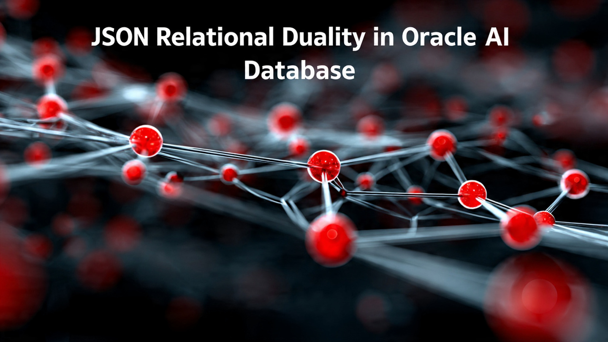

# Working with JSON Relational Duality in Oracle AI Database and Google Colab Notebooks. 
 
## Introduction

Combine the simplicity of the JSON document model with the power of the relational model using [JSON Relational Duality](https://www.oracle.com/in/database/json-relational-duality/). This transformative data modeling capability in Oracle AI Database solves the age-old problem of object-relational mismatch, letting applications simultaneously treat the same underlying data as JSON documents or relational tables.


      
Estimated Time: 5 mins.  
 
### Objectives

In this article, we will create a few simple master-detail tables, create corresponding JSON Relational Duality Views, do a couple of Create, Read, Update, and Delete Operations, see how to use Google Colab Notebook to run these.  
   
### Prerequisites

This lab assumes you have:

* Oracle cloud account and privileges to create & manage Oracle Autonomous AI Database
* Oracle Autonomous AI database wallet has been downloaded into local filesystem. 
* Source code has been downloaded.
 
### Source code download
 
```
<copy>
-- Clone the GitHub Repo
git clone https://github.com/madhusudhanrao-ppm/dbdevrel.git

-- Colab Notebook on GitHub
https://github.com/madhusudhanrao-ppm/dbdevrel/blob/main/source-codes/colab-code/json-relational-duality.ipynb

</copy>
``` 
 
## Task 1: Set Up Your Google Colab Environment

1. Install the oracledb driver:

    ```
    <copy>
    !pip install oracledb 
    </copy>
    ``` 

2. Import required libraries and mount Google Drive to access your database wallet:
    
    ```
    <copy>
    import os
    import oracledb
    import pandas as pd
    from google.colab import drive
    drive.mount('/content/drive') 
    </copy>
    ``` 

3. Configure the connection parameters and connect to Oracle AI Database using wallet-based authentication:

    ```
    <copy>
    # Connection parameters
    username = "DEMOUSER"  # Update with your username
    password = "<Your-Password>"  # Update with your password
    tns_name = "indeducation_high"  # Update with your TNS alias
    wall_config_dir = "/content/drive/MyDrive/Wallet_IndEducation"  # Update with your wallet path
    wall_pwd = "<Your-Password>"  # Update with your wallet password
    
    try:
        # Connect to Oracle Database
        conn = oracledb.connect(user=username,
                                password=password,
                                dsn=tns_name,
                                config_dir=wall_config_dir,
                                wallet_location=wall_config_dir,
                                wallet_password=wall_pwd)

        print("✓ Successfully connected to Oracle Database")
    except Exception as e:
        print(f"✗ Connection failed: {e}")
        conn = None
    </copy>
    ``` 

## Task 2: Create Tables for JSON Relational Duality

1. Create the shops and shop_items tables. First, drop them if they already exist:
 
    ```
    <copy>
    # Drop existing tables if they exist
    if conn:
        try:
            cursor = conn.cursor()
            cursor.execute("DROP TABLE IF EXISTS shop_items PURGE")
            cursor.execute("DROP TABLE IF EXISTS shops PURGE")
            cursor.execute("DROP VIEW IF EXISTS shop_duality_view")
            conn.commit()
            print("✓ Cleaned up existing objects")
            cursor.close()
        except Exception as e:
            print(f"✗ Cleanup failed: {e}")
    </copy>
    ``` 

2. Now create the shops and shop_items tables with proper relationships:

    ```
    <copy>
    # Create master-detail tables
    if conn:
        try:
            cursor = conn.cursor()

            # Create shops table
            cursor.execute("""
                CREATE TABLE shops (
                    shop_id NUMBER CONSTRAINT pk_shop_id PRIMARY KEY,
                    shop_name VARCHAR2(40),
                    location VARCHAR2(40)
                )
            """)
            
            # Create shop_items table with foreign key to shops
            cursor.execute("""
                CREATE TABLE shop_items (
                    item_no NUMBER CONSTRAINT pk_item_no PRIMARY KEY,
                    item_name VARCHAR2(40),
                    quantity_available NUMBER,
                    unit_price NUMBER,
                    shop_id NUMBER CONSTRAINT fk_shop_id REFERENCES shops
                )
            """)
            conn.commit()

            print("✓ Shops and shop_items tables created successfully")
            cursor.close()
        except Exception as e:
            print(f"✗ Table creation failed: {e}")
    else:
        print("✗ No database connection available")
    </copy>
    ``` 

## Task 3: Create JSON Relational Duality View

1. Create the JSON Relational Duality View (shop_duality_view) to enable simultaneous JSON document and relational table operations:
 
    ```
    <copy>
    # Create JSON Relational Duality View
    if conn:
        try:
            cursor = conn.cursor()

            # Execute query to create duality view
            cursor.execute("""
                CREATE JSON RELATIONAL DUALITY VIEW shop_duality_view AS
                    shops @insert @update @delete
                    {
                        _id               : shop_id,
                        shop_name         : shop_name,
                        location          : location,
                        items             : shop_items @insert @update @delete
                        [{
                            item_no            : item_no,
                            item_name          : item_name,
                            quantity_available : quantity_available,
                            unit_price         : unit_price
                        }]
                    }
            """)

            conn.commit()

            print("✓ JSON Relational Duality View (shop_duality_view) created")
            cursor.close()
        except Exception as e:
            print(f"✗ Duality view creation failed: {e}")
    else:
        print("✗ No database connection available") 
    </copy>
    ``` 

## Task 4: Insert Sample Data Using the Duality View

1. Insert sample shop and item data through the JSON Relational Duality View:

    ```
    <copy>
    if conn:
        try:
            cur = conn.cursor()
            # -------------------------------------------------
            # 1️⃣  Insert two shops with items via duality view
            # -------------------------------------------------
            cur.execute("""
                INSERT INTO shop_duality_view (data) VALUES (
                    '{"_id":100,
                      "shop_name":"Tech Haven",
                      "location":"New York",
                      "items":[{"item_no":101,
                                "item_name":"Laptop",
                                "quantity_available":15,
                                "unit_price":1299.99},
                               {"item_no":102,
                                "item_name":"Wireless Mouse",
                                "quantity_available":42,
                                "unit_price":25.50}]}
                ')
            """)

            cur.execute("""
                INSERT INTO shop_duality_view (data) VALUES (
                    '{"_id":200,
                      "shop_name":"Grocery Corner",
                      "location":"Los Angeles",
                      "items":[{"item_no":201,
                                "item_name":"Organic Apples",
                                "quantity_available":80,
                                "unit_price":1.20},
                               {"item_no":202,
                                "item_name":"Whole Grain Bread",
                                "quantity_available":30,
                                "unit_price":2.75}]}
                ')
            """)

            conn.commit()
            print("✅ Sample shops and items inserted via the duality view.")
            cur.close()
        except Exception as e:
            print(f"✗ Insert failed: {e}")
    else:
        print("✗ No database connection available")
    </copy>
    ``` 

## Task 5: Query and Display Data

1. Retrieve and display the inserted data as formatted JSON documents:

    ```
    <copy>
    if conn:
        try:
            cur = conn.cursor()

            result = cur.execute("""
                SELECT JSON_SERIALIZE(data PRETTY) AS shop_json
                FROM   shop_duality_view
            """)
            
            print("✓ Shops and Items data (JSON format):")
            print("-" * 50)
            for row in result:
                print(row[0])
                
            cur.close()
        except Exception as e:
            print(f"✗ SELECT failed: {e}")
    else:
        print("✗ No database connection available") 
    </copy>
    ``` 

## Task 6: Update Records in the Duality View

1. Update an existing shop record using the JSON Relational Duality View:

    ```
    <copy>
    if conn:
        try:
            cur = conn.cursor()

            # Update shop details via duality view
            cur.execute("""
                UPDATE shop_duality_view
                SET data = '{
                    "_id":100,
                    "shop_name":"Tech Haven Premium",
                    "location":"Manhattan, New York",
                    "items":[{"item_no":101,
                              "item_name":"Laptop",
                              "quantity_available":20,
                              "unit_price":1399.99},
                             {"item_no":102,
                              "item_name":"Wireless Mouse",
                              "quantity_available":50,
                              "unit_price":29.99}]
                }'
                WHERE JSON_VALUE(data, '$._id') = 100
            """)

            conn.commit()
            print("✅ Shop record updated successfully.")
            cur.close()
        except Exception as e:
            print(f"✗ Update failed: {e}")
    else:
        print("✗ No database connection available")
    </copy>
    ```

2. Verify the updated record:

    ```
    <copy>
    if conn:
        try:
            cur = conn.cursor()

            result = cur.execute("""
                SELECT JSON_SERIALIZE(data PRETTY) AS shop_json
                FROM   shop_duality_view
                WHERE  JSON_VALUE(data, '$._id') = 100
            """)
            
            print("✓ Updated shop record (ID 100):")
            print("-" * 50)
            for row in result:
                print(row[0])
                
            cur.close()
        except Exception as e:
            print(f"✗ SELECT failed: {e}")
    else:
        print("✗ No database connection available")
    </copy>
    ```

## Task 7: Delete Records from the Duality View

1. Delete a shop record (and its associated items) using the JSON Relational Duality View:

    ```
    <copy>
    if conn:
        try:
            cur = conn.cursor()

            # Delete shop record via duality view
            cur.execute("""
                DELETE FROM shop_duality_view
                WHERE JSON_VALUE(data, '$._id') = 200
            """)

            conn.commit()
            print("✅ Shop record (ID 200) deleted successfully.")
            cur.close()
        except Exception as e:
            print(f"✗ Delete failed: {e}")
    else:
        print("✗ No database connection available")
    </copy>
    ```

2. Verify the deletion by listing all remaining records:

    ```
    <copy>
    if conn:
        try:
            cur = conn.cursor()

            result = cur.execute("""
                SELECT JSON_SERIALIZE(data PRETTY) AS shop_json
                FROM   shop_duality_view
            """)
            
            print("✓ Remaining shops after deletion:")
            print("-" * 50)
            rows = result.fetchall()
            if rows:
                for row in rows:
                    print(row[0])
            else:
                print("No shops found in the database.")
                
            cur.close()
        except Exception as e:
            print(f"✗ SELECT failed: {e}")
    else:
        print("✗ No database connection available")
    </copy>
    ```

## Task 8: Close Connection

2. Close the database connection:

    ```
    <copy>
    # Close database connection
    if conn:
        try:
            conn.close()
            print("✓ Database connection closed")
        except Exception as e:
            print(f"✗ Error closing connection: {e}")
    </copy>
    ```

## Learn More & Downloads
 
* [JSON Relational Duality Views Documentation](https://docs.oracle.com/en-us/iaas/autonomous-database-serverless/doc/json-relational-duality-views.html) 
* [Autonomous AI Database for Developers](https://docs.oracle.com/en-us/iaas/autonomous-database-serverless/doc/autonomous-database-for-developers.html) 
* [Source Code - JSON Relational Duality Notebook](https://github.com/madhusudhanrao-ppm/dbdevrel/blob/main/source-codes/colab-code/json-relational-duality.ipynb)
* [Download All Source Code](https://github.com/madhusudhanrao-ppm/dbdevrel/tree/main/source-codes)
* [Direct ORM Deployment Link](https://cloud.oracle.com/resourcemanager/stacks/create?zipUrl=https://objectstorage.us-phoenix-1.oraclecloud.com/p/jtfUsV33KtLR937hWybAgrq8qtuQQuAaIw1K_VBThhlUF6Z1HYF0Ai50sQlp06bQ/n/oradbclouducm/b/medical_transcripts/o/Terraform/oracle-lakehouse-devedition-stack.zip)
* [Autonomous AI Database for Developers Billing Information](https://docs.oracle.com/en-us/iaas/autonomous-database-serverless/doc/autonomous-database-for-developers-billing.html)

## Acknowledgements

* **Author** - Madhusudhan Rao, Principal Product Manager, Oracle Database DevRel 
* **Last Updated By/Date** - December 16, 2025
